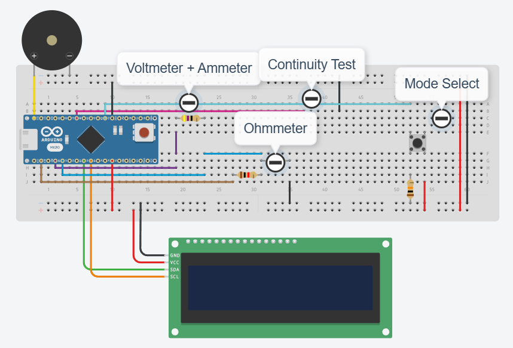

# Reverse Engineered Digital Multimeter (DMM) using Arduino Nano

This project is a reverse-engineered digital multimeter (DMM) built using an **Arduino Nano** and a **LiquidCrystal_I2C** display. The multimeter can be used in four modes: **Voltmeter**, **Ammeter**, **Ohmmeter**, and **Continuity Tester**. A push button is used to toggle between these modes, and the results are displayed on the LCD.
<a href="https://www.overleaf.com/read/bmqmjphvwvmj#7c8530">Purdue ECE39595: Reverse Engineering - Full Journal Report</a>

## Features

- **Voltmeter Mode**: Measure voltage in the circuit and display the result in volts.
- **Ammeter Mode**: Measure current by calculating the voltage drop across a known resistor.
- **Ohmmeter Mode**: Measure resistance by using Ohm’s Law.
- **Continuity Mode**: Detect whether a connection exists and activate a buzzer when continuity is found.

## Schematic

## Pinout

| Pin               | Component               | Description                              |
|-------------------|-------------------------|------------------------------------------|
| `modeSelectPin`   | Push Button             | Switches between the DMM modes.          |
| `continuityPin`   | Continuity Test Probe   | Used to test continuity and trigger the buzzer. |
| `buzzer`          | Buzzer                  | Emits sound when continuity is detected. |
| `VCCreadPin`      | Voltage Reading Pin     | Reads the analog voltage on the VCC rail. |
| `ohmmeterPin`     | Ohmmeter Probe Pin      | Reads the analog voltage drop for resistance measurement. |

## Components

- **Arduino Nano**: The microcontroller for the project.
- **LCD (LiquidCrystal_I2C)**: Displays the readings for voltage, current, resistance, or continuity.
- **Push Button**: Used to toggle between different measurement modes.
- **Buzzer**: Emits a sound in Continuity Mode when a closed circuit is found.
- **Resistors**: For setting measurement ranges (1kΩ for Ohmmeter, 47Ω for Ammeter). Note: the Ohmmeter resistor can be adjusted to your desired range.
