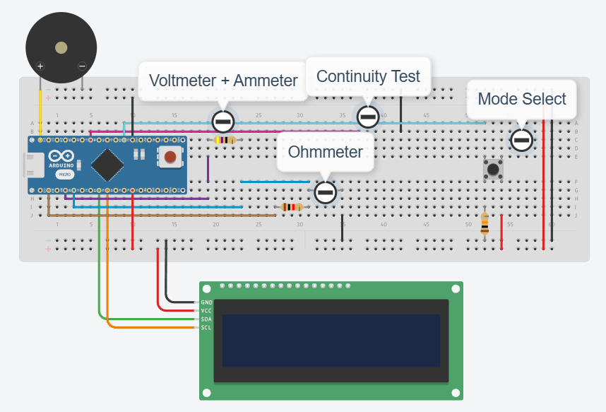

# Reverse Engineered Digital Multimeter (DMM) using Arduino Nano

This project is a reverse-engineered digital multimeter (DMM) built using an **Arduino Nano** and a **LiquidCrystal_I2C** display. The multimeter can be used in four modes: **Voltmeter**, **Ammeter**, **Ohmmeter**, and **Continuity Tester**. A push button is used to toggle between these modes, and the results are displayed on the LCD.
<a href="https://www.overleaf.com/read/bmqmjphvwvmj#7c8530">Purdue ECE39595: Reverse Engineering - Full Journal Report</a>


## Features

- **Voltmeter Mode**: Measure voltage in the circuit and display the result in volts.
- **Ammeter Mode**: Measure current by calculating the voltage drop across a known resistor.
- **Ohmmeter Mode**: Measure resistance by using Ohm’s Law.
- **Continuity Mode**: Detect whether a connection exists and activate a buzzer when continuity is found.

## Schematic



## Pinout

| Pin               | Component               | Description                              |
|-------------------|-------------------------|------------------------------------------|
| `modeSelectPin`   | Push Button             | Switches between the DMM modes.          |
| `continuityPin`   | Continuity Test Probe   | Used to test continuity and trigger the buzzer. |
| `buzzer`          | Buzzer                  | Emits sound when continuity is detected. |
| `VCCreadPin`      | Voltage Reading Pin     | Reads the analog voltage on the VCC rail. |
| `ohmmeterPin`     | Ohmmeter Probe Pin      | Reads the analog voltage drop for resistance measurement. |

## Components

- **Arduino Nano**: The microcontroller for the project.
- **LCD (LiquidCrystal_I2C)**: Displays the readings for voltage, current, resistance, or continuity.
- **Push Button**: Used to toggle between different measurement modes.
- **Buzzer**: Emits a sound in Continuity Mode when a closed circuit is found.
- **Resistors**: For setting measurement ranges (1kΩ for Ohmmeter, 47Ω for Ammeter). Note: the Ohmmeter resistor can be adjusted to your desired range.

## How to Use

### Initial Setup

1. **Wiring**: 
   - Connect the `modeSelectPin` to a push button.
   - Attach the `continuityPin` to one of the probes.
   - Use the `VCCreadPin` and `ohmmeterPin` for reading voltages in different modes.
   - Connect the buzzer to the appropriate pin for continuity testing.
   
2. **Upload the Code**:
   Upload the provided code to your Arduino Nano using the Arduino IDE.

### Mode Selection

Once the code is uploaded and the Arduino Nano is powered on, you can use the **push button** to cycle through the different modes:

1. **Voltmeter Mode**: Measures voltage in the circuit.
2. **Ammeter Mode**: Measures current by calculating the voltage drop across a known resistor.
3. **Ohmmeter Mode**: Measures resistance using a known resistor.
4. **Continuity Mode**: Detects continuity and activates the buzzer when a closed circuit is found.

### Reading Measurements

- **Voltmeter**: When in Voltmeter mode, the voltage across the `VCCreadPin` is displayed in volts.
- **Ammeter**: The current is calculated based on the voltage drop across the `VCCreadPin` and displayed in amps.
- **Ohmmeter**: Resistance is calculated using the voltage drop across the unknown resistor, with a known resistor for reference. The resistance value is shown on the LCD.
- **Continuity Tester**: When probes form a closed circuit, the buzzer is triggered, and `!!CONDUCTIVE!!` is displayed. If no continuity is detected, the LCD will show `..............`.

## Code Overview

The code consists of a state machine to toggle between the modes, along with the necessary calculations for voltage, current, resistance, and continuity detection. Here’s an overview of the key sections of the code:

### **Mode Selection**

The mode is selected by pressing the push button. The button press is debounced to avoid multiple readings from one press. Each time the button is pressed, the mode changes and the corresponding reading is displayed on the LCD.

```cpp
if (pressed == HIGH) {
  if ((millis() - lastDebounceTime) > debounceDelay) {
    state = (state != 4) ? state + 1 : 1;
    lastDebounceTime = millis();
    lcd.clear();
    switch (state) {
      case 1: lcd.setCursor(0, 0); lcd.print("Voltmeter Mode"); break;
      case 2: lcd.setCursor(0, 0); lcd.print("Ammeter Mode"); break;
      case 3: lcd.setCursor(0, 0); lcd.print("Ohmmeter Mode"); break;
      case 4: lcd.setCursor(0, 0); lcd.print("Continuity Mode"); break;
    }
  }
}
```
## Voltmeter Mode
In Voltmeter Mode, the code reads the voltage on the VCCreadPin and displays the voltage on the LCD.

```cpp
sensorValue = analogRead(VCCreadPin);
voltage = sensorValue * (5.0 / 1023.0);
lcd.setCursor(0, 1);
lcd.print(voltage, 2);
```
## Ammeter Mode
The Ammeter mode calculates current using the voltage measured at the VCCreadPin and displays it in amps.

```cpp
sensorValue = analogRead(VCCreadPin);
voltage = sensorValue * (5.0 / 1023.0);
lcd.setCursor(0, 1);
lcd.print(voltage / ammeter_resistor, 2);
```
## Ohmmeter Mode
In the Ohmmeter mode, the code calculates the unknown resistance based on voltage readings, using a known resistor.

```cpp
sensorValue = analogRead(ohmmeterPin);
voltage = sensorValue * (5.0 / 1023.0);
ohms = voltage / (((analogRead(VCCreadPin) * (5.0 / 1023.0)) - voltage) / ohmmeter_resistor);
lcd.setCursor(0, 1);
lcd.print(ohms);
```
## Continuity Mode
The Continuity mode detects if the probes are connected to a conductive material. If continuity is detected, the buzzer will sound, and the LCD will show !!CONDUCTIVE!!.

```cpp

int continuity = digitalRead(continuityPin);
if (continuity == LOW) {
    digitalWrite(buzzer, HIGH); // Turn buzzer ON
    lcd.setCursor(0, 1);
    lcd.print("!!CONDUCTIVE!!");
} else {
    digitalWrite(buzzer, LOW); // Turn buzzer OFF
    lcd.setCursor(0, 1);
    lcd.print("..............");
}
```
